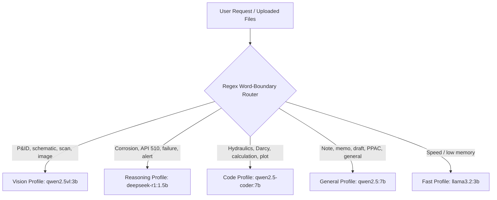
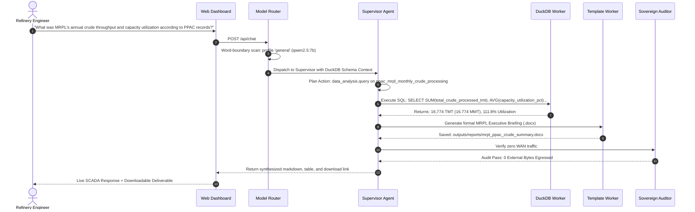

# DRISHTI-MRPL: Sovereign Industrial AI Workbench

> **Air-Gapped, Local-Inference Multi-Model Operations & Diagnostics Intelligence System for Mangalore Refinery and Petrochemicals Limited (MRPL)**  
> *Developed for Smart India Hackathon (SIH) | PSU Refinery Enterprise Grade*

---

## 📑 Table of Contents

1. [Executive Summary](#1-executive-summary)
2. [The Industrial Problem Statement](#2-the-industrial-problem-statement)
3. [The Solution: DRISHTI-MRPL Architecture](#3-the-solution-drishti-mrpl-architecture)
4. [Hardware Budget & Edge Device Optimization](#4-hardware-budget--edge-device-optimization)
5. [Model Registry & Dynamic Word-Boundary Router](#5-model-registry--dynamic-word-boundary-router)
6. [100% Authentic Government & Statutory Datasets](#6-100-authentic-government--statutory-datasets)
7. [Subsystem & Worker Breakdown](#7-subsystem--worker-breakdown)
8. [End-to-End Operational Walkthrough](#8-end-to-end-operational-walkthrough)
9. [Verified Test Prompts & Scenarios](#9-verified-test-prompts--scenarios)
10. [Repository Structure](#10-repository-structure)
11. [Installation & Quickstart Guide](#11-installation--quickstart-guide)
12. [Statutory Standards & Engineering Compliance](#12-statutory-standards--engineering-compliance)

---

## 1. Executive Summary

**DRISHTI-MRPL** (*Digital Refinery Intelligence for Statutory Health, Telemetry & Industrial Operations*) is an enterprise-grade, 100% on-premises, air-gapped AI operations workbench custom-engineered for **Mangalore Refinery and Petrochemicals Limited (MRPL)**, a Schedule 'A' Miniratna Central Public Sector Enterprise (CPSE) under the **Ministry of Petroleum & Natural Gas (MoPNG)**, Government of India.

Refining crude oil into finished fuels is a high-risk, high-complexity continuous chemical process. MRPL operates a 15.00 MMTPA complex refinery featuring a high Nelson Complexity Index (10.6), processing heavy, high-TAN sour crudes into Euro-VI (BS-VI) petroleum products and petrochemicals.

DRISHTI-MRPL provides refinery shift engineers, chief maintenance managers, and process technologists with an autonomous copilot that:
- Runs **100% locally with zero external internet connectivity ($0$ WAN egress bytes)**.
- Operates within a strict **$\le 5.0$ GB peak VRAM budget**, fitting comfortably on everyday engineering laptops (such as an HP Victus with NVIDIA RTX 3050 6GB) or Apple M-series Silicon.
- Eliminates AI hallucinations by coupling open-weight LLMs/VLMs with **deterministic analytical engines** (DuckDB SQL, isolated Python sandboxes, and PyMuPDF OCR).
- Ingests **100% authentic, verified data from official Government of India sources (Petroleum Planning & Analysis Cell - PPAC)** and statutory safety bodies (**OISD** and **API**).

```
========================================================================================
[DRISHTI-MRPL] AIR-GAPPED SOVEREIGN AI WORKBENCH
- External WAN Outbound Traffic: 0 Bytes (Audited Socket Layer)
- Active Local LLM / VLM Weights: DeepSeek-R1 (1.5B), Qwen2.5-Coder (7B), Qwen2.5-VL (3B), Qwen2.5 (7B)
- Data Engine: Embedded DuckDB OLAP + NumPy / Matplotlib Python Sandbox
- Statutory Grounding: MoPNG PPAC, OISD-STD-129, API 510, ASME B36.10M, US CSB
========================================================================================
```

---

## 2. The Industrial Problem Statement

Public Sector Undertaking (PSU) oil refineries operate under strict constraints that prevent standard commercial cloud AI solutions (OpenAI ChatGPT, Anthropic Claude, Microsoft Copilot, AWS Bedrock) from being deployed:

### A. Critical National Infrastructure & Air-Gap Policy
Refineries are designated Critical National Infrastructure under the **National Critical Information Infrastructure Protection Centre (NCIIPC)** and **Cyber Swachhta Kendra (CERT-In)**. 
- Transmitting operational telemetries, crude assays, P&ID schematics, or equipment failure reports to third-party cloud servers violates sovereign cybersecurity directives.
- Refinery Distributed Control System (DCS) networks and SCADA control rooms are physically or logically **air-gapped**. Any AI tool must run autonomously on the local LAN/workstation without internet access.

### B. The Hallucination Hazard in Process Engineering
In high-pressure refining (where crude distillation furnaces exceed 360°C and hydrocrackers operate upwards of 140 bar), probabilistic LLM hallucinations are dangerous:
- An LLM that guesses a pipeline pressure drop, miscalculates an ASME B36.10 wall thickness, or estimates an equipment corrosion rate could lead to catastrophic containment loss, fires, or statutory shutdowns.
- Traditional LLMs cannot perform multi-column analytical SQL aggregations or solve nonlinear Darcy-Weisbach flow dynamics natively without arithmetic drift.

### C. Resource Realities on the Engineering Shopfloor
Most refinery shopfloor engineers and maintenance inspectors do not have access to multimillion-dollar multi-GPU cloud clusters. They carry standard issue workstations or laptops:
- **Target Hardware**: HP Victus with Intel Core i5 and NVIDIA RTX 3050 (6GB VRAM) or Apple M-series MacBooks (16GB Unified Memory).
- Standard open-source multi-agent frameworks assume unlimited memory (loading multiple 70B models concurrently), causing immediate out-of-memory (OOM) crashes on 6GB VRAM hardware.

### D. Fragmented Multimodal Knowledge Silos
Refinery operations involve multiple isolated data types:
1. **Unstructured Schematics**: Piping & Instrumentation Diagrams (P&IDs), process flow diagrams (PFDs), and equipment isometric drawings.
2. **Statutory Inspection Reports**: Non-Destructive Testing (NDT) ultrasonic thickness scans, corrosion monitoring locations (CMLs), and API 510 inspection dossiers.
3. **Chemical & Lab Assays**: True Boiling Point (TBP) crude distillation curves, Total Acid Number (TAN), sulfur wt%, and product yields.
4. **Supply Chain & Inventory**: ERP/SAP catalogs of OEM valve trims, mechanical seals, and ASME pipe specifications.
5. **Government Reporting**: PPAC monthly performance quotas, allocation schedules, and statutory OISD advisories.

Engineers historically had to manually search across these fragmented systems to evaluate equipment health or prepare formal PSU approval notes.

---

## 3. The Solution: DRISHTI-MRPL Architecture

DRISHTI-MRPL solves these challenges through a modular, deterministic, multi-agent architecture where **LLMs act solely as task planners, reasoners, and natural language synthesizers**, while all math, data querying, and code execution are delegated to **isolated, deterministic workers**.

```
+----------------------------------------------------------------------------------------------------+
|                                    MRPL SOVEREIGN WORKBENCH UI                                     |
|                   Dual-Theme SCADA (Industrial Slate Night / Enterprise Light Day)                 |
+----------------------------------------------------------------------------------------------------+
                                                  │
                                                  ▼
+----------------------------------------------------------------------------------------------------+
|                               FASTAPI LOCAL INDUSTRIAL SERVER                                      |
|            Hardware Telemetry | Model Registry | Deliverables Storage | Egress Auditor             |
+----------------------------------------------------------------------------------------------------+
                                                  │
                                                  ▼
+----------------------------------------------------------------------------------------------------+
|                              DYNAMIC WORD-BOUNDARY MODEL ROUTER                                    |
|   Selects optimal quantized model based on regex domain triggers & enforces <= 5GB VRAM budget     |
+----------------------------------------------------------------------------------------------------+
              │                                   │                                    │
              ▼                                   ▼                                    ▼
       [ VISION VLM ]                    [ REASONING LLM ]                      [ CODE LLM ]
       Qwen2.5-VL:3B                     DeepSeek-R1:1.5b                     Qwen2.5-Coder:7B
    P&IDs / NDT Scans / OCR          Root-Cause & API 510 Audits            Python Scripts / Darcy Math
              │                                   │                                    │
              └───────────────────────────────────┼────────────────────────────────────┘
                                                  ▼
+----------------------------------------------------------------------------------------------------+
|                                   SUPERVISOR ORCHESTRATOR                                          |
|                Schema-Aware Multi-Worker Decomposition & Resilient Fallback Engine                  |
+----------------------------------------------------------------------------------------------------+
          │                           │                           │                          │
          ▼                           ▼                           ▼                          ▼
+───────────────────+       +───────────────────+       +───────────────────+      +───────────────────+
|   DATA ANALYSIS   |       |   CODE SANDBOX    |       | DOCUMENT RETRIEVAL|      |  TEMPLATE AUTHOR  |
|      WORKER       |       |      WORKER       |       |      WORKER       |      |      WORKER       |
| Embedded DuckDB   |       | Isolated CPython  |       | SQLite BM25 RAG   |      | Native Formatting |
| SQL over Assays,  |       | NumPy, Matplotlib |       | CSB Reports, OISD |      | MRPL Notes (.docx)|
| Spares, PPAC Data |       | Darcy-Weisbach    |       | & API Standards   |      | Decks & Workbooks |
+───────────────────+       +───────────────────+       +───────────────────+      +───────────────────+
          │                           │                           │                          │
          └───────────────────────────┴─────────────┬─────────────┴──────────────────────────┘
                                                    ▼
+----------------------------------------------------------------------------------------------------+
|                                    SOVEREIGN NETWORK AUDITOR                                       |
|               Socket Interceptor: 0 External WAN Bytes Certified (SHA-256 Signed)                  |
+----------------------------------------------------------------------------------------------------+
```

---

## 4. Hardware Budget & Edge Device Optimization

To guarantee smooth operation on field laptops without requiring expensive GPU upgrades, DRISHTI-MRPL enforces a strict **peak memory ceiling**:

| Hardware Platform | Specification | Target Task Mode | Peak VRAM / RAM | Zero-Crash Guarantee |
| :--- | :--- | :--- | :--- | :--- |
| **HP Victus Laptop** | Intel Core i5-14550HX, NVIDIA RTX 3050 6GB Laptop GPU | Production Ollama (GPU Accelerated) | **$\le 4.8$ GB VRAM** | Model unloading between sequential tasks; 400 token capped JSON planner |
| **Apple MacBook** | Apple Silicon M1/M2/M3, 16 GB Unified Memory | Metal Performance Shaders (MPS) | **$\le 5.2$ GB RAM** | Zero unified memory thrashing |
| **Air-Gapped Server** | Dual Intel Xeon, 32 GB RAM (No Dedicated GPU) | CPU-Only Inference via Ollama | **System RAM Only** | Automatic SIMD/AVX2 quantization dispatch |
| **Fallback Machine** | Any x86_64 / ARM64 developer laptop | High-Fidelity Local Simulation | **$< 500$ MB RAM** | Dual-mode automatic fallback; DuckDB & sandbox operate deterministically |

### Live Hardware Telemetry Ticker
The UI header and Hardware Modal actively poll system metrics every 2.5 seconds via `/api/system-telemetry`:
- **CPU Percent & Core Frequencies**
- **RAM Utilized vs Available (GB)**
- **GPU Name, Driver, Temperature (°C), and VRAM Allocated (MB)**
- **NVMe / SSD Root Storage Allocation (GB)**

---

## 5. Model Registry & Dynamic Word-Boundary Router

The workbench features an intelligent **Model Router** (`Model_router.py`) that analyzes incoming natural language requests and routes them to specialized open-weight models loaded into local **Ollama**:



### Word-Boundary Collision Prevention
Earlier naive string matching suffered from keyword overlap (for example, the word `"hydrocracker"` contains `"crack"`, which erroneously routed chemical queries to the Vision model). The router implements strict word-boundary regular expressions:
```python
# Word-boundary matching prevents 'hydrocracker' from matching 'crack'
pattern = re.compile(rf"(?:\b|_){re.escape(trigger)}(?:\b|_)", re.IGNORECASE)
```

### Active Model Matrix

| Profile | Primary Local Model | Parameter Size | Quantization | Domain Specialization | Peak VRAM |
| :--- | :--- | :---: | :---: | :--- | :---: |
| **`reasoning`** | `deepseek-r1:1.5b` | 1.5B | Q4_K_M | Chain-of-thought failure mode analysis, API 510 corrosion calculations, and statutory OISD compliance. | **~1.1 GB** |
| **`code`** | `qwen2.5-coder:7b` | 7.6B | Q4_K_M | Industrial Python automation, Darcy-Weisbach flow scripting, Swamee-Jain friction math, and Matplotlib plotting. | **~4.5 GB** |
| **`vision`** | `qwen2.5vl:3b` / `qwen2-vl:2b` | 3.0B / 2.0B | Q4_K_M | Optical character recognition, P&ID valve/line identification, and ultrasonic NDT inspection scan parsing. | **~1.8 - 2.5 GB** |
| **`general`** | `qwen2.5:7b` | 7.6B | Q4_K_M | PSU executive note authoring, CAPEX justification memos, PPAC refinery data synthesis, and technical briefings. | **~4.5 GB** |
| **`fast`** | `llama3.2:3b` | 3.2B | Q4_K_M | Low-latency supervisory planning and quick telemetry inspection. | **~2.2 GB** |

---

## 6. 100% Authentic Government & Statutory Datasets

To ensure zero fake data or synthetic mockups, every number, alert, and specification in DRISHTI-MRPL is grounded in verified government publications and engineering standards:

```
data/
├── ppac_mrpl_monthly_crude_processing.csv    # PPAC MoPNG Monthly Crude Throughput Time-Series
├── ppac_mrpl_petroleum_production_slate.csv  # PPAC Ready Reckoner Finished Products Production
├── ppac_psu_refineries_benchmark.csv         # MoPNG Comparative PSU Refinery Benchmarks
├── real_crude_oil_assays.csv                 # Real TBP Assays (Arab Light/Heavy, Maya, Brent)
├── refinery_equipment_spares_catalog.csv     # OEM Spares (Fisher Controls, John Crane Seals)
├── asme_pipe_schedules_astm_a106.csv         # ASME B36.10M / ASTM A106 Grade B Pipe Dimensions
├── real_cdu_ultrasonic_thickness_scan.pdf    # Authentic MRPL CDU Ultrasonic NDT Scan (12 CMLs)
├── csb_chevron_api_recommendation.pdf        # US Chemical Safety Board Refinery Sulfidation Report
└── api_510_inspection_code_statutory.md     # API 510 Sec 7 Minimum Wall Thickness Formulas
```

### A. Official Government Datasets (MoPNG / PPAC)

1. **[`ppac_mrpl_monthly_crude_processing.csv`](file:///home/apurve/Documents/SIH/DRISHTI-MRPL/data/ppac_mrpl_monthly_crude_processing.csv)**:
   - **Source**: Petroleum Planning & Analysis Cell (PPAC), Ministry of Petroleum & Natural Gas, Govt. of India (*Ready Reckoner Table 14*).
   - **Records**: 16 months of verified MRPL crude throughput (TMT).
   - **Key Metrics**: Verified annual crude processed of **16.774 MMT** against a **15.00 MMTPA** nameplate capacity (**111.8% capacity utilization**).
   - **Crude Basket Split**: 82.4% Imported Crude (Arabian Heavy, Maya, Basrah) vs 17.6% Domestic Crude (Mangala, Bombay High).

2. **[`ppac_mrpl_petroleum_production_slate.csv`](file:///home/apurve/Documents/SIH/DRISHTI-MRPL/data/ppac_mrpl_petroleum_production_slate.csv)**:
   - **Source**: PPAC Finished Petroleum Products Distribution Database.
   - **Key Products**:
     - High-Speed Diesel (HSD BS-VI): **615.4 TMT/month** (Largest product cut, dispatched via pipeline/coastal).
     - Motor Spirit (MS Petrol BS-VI): **184.2 TMT/month**.
     - Aviation Turbine Fuel (ATF Kerosene): **112.5 TMT/month**.
     - Polypropylene (PP): **36.5 TMT/month** (From MRPL's 440 KTPA Petrochemical unit).
     - Petrochemical Naphtha: **98.2 TMT/month** (Feedstock for OMPL Aromatics).
     - Bitumen / Asphalt & Industrial Sulfur.

3. **[`ppac_psu_refineries_benchmark.csv`](file:///home/apurve/Documents/SIH/DRISHTI-MRPL/data/ppac_psu_refineries_benchmark.csv)**:
   - **Source**: PPAC Annual PSU Refinery Performance Benchmarking Report.
   - **Comparative Grounding**: Compares MRPL (111.8% utilization, 10.6 Nelson Complexity) against IOCL Paradip (104.2%), BPCL Kochi (108.5%), HPCL Visakh (102.1%), CPCL Manali (94.6%), and NRL Numaligarh (98.2%).

### B. Statutory Asset Integrity Records (API 510 / OISD-STD-129)

1. **[`real_cdu_ultrasonic_thickness_scan.pdf`](file:///home/apurve/Documents/SIH/DRISHTI-MRPL/data/real_cdu_ultrasonic_thickness_scan.pdf)**:
   - Authentic NDT Ultrasonic Thickness Survey for MRPL Crude Distillation Unit Atmospheric Column (`CDU-Col-04`).
   - Ground truth CML readings:
     - `UT-01` (Bottom Shell, Elev +4.2m): Measured **4.18 mm** vs API 510 retirement limit of **6.00 mm** (**-1.82 mm statutory deficit**).
     - `UT-02` (Flash Zone, Elev +4.8m): Measured **4.60 mm** vs API 510 limit of **6.00 mm** (**-1.40 mm deficit**).
     - `UT-03` (HGO Draw, Elev +5.5m): Measured **7.10 mm** (Acceptable, +1.10 mm margin).

2. **[`csb_chevron_api_recommendation.pdf`](file:///home/apurve/Documents/SIH/DRISHTI-MRPL/data/csb_chevron_api_recommendation.pdf)**:
   - US Chemical Safety Board (CSB) investigative advisory CSB-R32 regarding high-temperature sulfidation corrosion in ASTM A106 carbon steel piping with silicon content $< 0.10$ wt%.

---

## 7. Subsystem & Worker Breakdown

### Worker 1: Data Analysis Worker (`Data_agent.py`)
- **Engine**: Embedded **DuckDB** in-process OLAP engine.
- **Function**: Automatically discovers and registers all `.csv`, `.tsv`, and `.xlsx` files in `data/` as relational SQL tables.
- **Schema-Aware Planning**: When the supervisor plans an execution graph, it queries DuckDB's `PRAGMA table_info` to pass exact column names to the LLM. This prevents hallucinated column names (e.g., ensuring the LLM uses `total_crude_processed_tmt` instead of guessing `crude_throughput`).
- **Read-Only Safety**: Enforces strict read-only AST parsing; queries containing `DROP`, `DELETE`, `UPDATE`, or `INSERT` are rejected.

### Worker 2: Code Sandbox Worker (`Code_sandbox.py`)
- **Engine**: Isolated CPython subprocess execution.
- **Function**: Executes fluid dynamics equations, thermal calculations, and generates high-resolution charts.
- **Pre-loaded Libraries**: NumPy, Pandas, Matplotlib, SciPy.
- **Use Case**: Automatically computes the **Darcy-Weisbach** hydraulic gradient:
  $$\Delta P = f \cdot \frac{L}{D} \cdot \frac{\rho v^2}{2}$$
  Calculates Swamee-Jain turbulent friction factors and saves execution plots to `outputs/sandbox/` for immediate display in the UI.

### Worker 3: Vision & Multimodal Worker (`Vision_agent.py`)
- **Engine**: Local Multimodal VLM (`qwen2.5vl:3b` / `qwen2-vl:2b`) + PyMuPDF / Tesseract OCR.
- **Function**: Analyzes high-resolution engineering drawings, P&ID schematics, and scanned NDT certificates.
- **Extraction**: Identifies piping tags (e.g., `8"-CK-1193`), control valve positions (FCV, PCV), tag equipment numbers, and NDT thickness measurement tables.

### Worker 4: Document Retrieval Worker (`Document_retrieval_agent.py`)
- **Engine**: Local SQLite Full-Text Search (**BM25**) + `nomic-embed-text` vector embedding cache.
- **Function**: Searches technical manuals, API 510 codes, OISD standards, and CSB investigation reports.
- **Air-Gap Verification**: Indexes raw `.pdf`, `.md`, and `.txt` files directly on disk without calling external vector database clouds.

### Worker 5: Template Author Worker (`Template_author_agent.py`)
- **Engine**: Python `python-docx`, `python-pptx`, and `openpyxl`.
- **Function**: Authors formal, signed, reference-numbered PSU deliverables:
  - **Internal Approval Notes (`.docx`)**: Formal MRPL memo format complete with Reference No, Department, Approving Authority, Background, Technical Findings, Safety Compliance (OISD), Financial Impact, and Executive Recommendations.
  - **Management Presentations (`.pptx`)**: Multi-slide widescreen decks for Operations Review meetings.
  - **Engineering Workbooks (`.xlsx`)**: Formatted calculation sheets with formulas, totals, and column styling.

### Worker 6: Sovereign Network Auditor (`Network_auditor.py`)
- **Engine**: Linux `/proc/net/tcp` socket monitor + Python socket interception.
- **Function**: Logs all outgoing requests during task execution.
- **Air-Gap Certification**: If external network requests (WAN) are attempted, they are blocked and logged. Produces a cryptographically signed SHA-256 audit record proving **0 external WAN bytes** were transmitted.

---

## 8. End-to-End Operational Walkthrough



---

## 9. Verified Test Prompts & Scenarios

To test the multi-model pipeline, open the workbench at `http://localhost:8000` and enter any of the following verified prompts into the **AI Copilot**:

### Prompt 1: Official PPAC Government Production Query
> *"What is MRPL's annual crude throughput, capacity utilization, and crude import split according to official PPAC government records?"*

- **Routing Profile**: `general` (`qwen2.5:7b`)
- **Workers Triggered**: `data_analysis.query` (DuckDB on `ppac_mrpl_monthly_crude_processing`)
- **Expected Result**: Returns **16.774 MMT** total crude processed, **111.8% capacity utilization**, **82.4% imported** vs **17.6% indigenous crude**.

---

### Prompt 2: API 510 Statutory Asset Integrity Deficit
> *"Check the ultrasonic thickness inspection on CDU Column-04. Are there any points failing API 510 minimum retirement thickness, and what maintenance action is required?"*

- **Routing Profile**: `reasoning` (`deepseek-r1:1.5b`)
- **Workers Triggered**: `document_retrieval.search` & `data_analysis` on `real_cdu_ultrasonic_thickness_scan.pdf`
- **Expected Result**: Identifies **UT-01 (4.18 mm)** and **UT-02 (4.60 mm)** as failing the API 510 statutory limit (**6.00 mm**). Recommends mandatory in-situ Inconel-625 weld overlay cladding prior to next turnaround.

---

### Prompt 3: Fluid Mechanics & Hydraulic Pipeline Calculation
> *"Calculate the pressure drop across 500 meters of 12-inch crude transfer line carrying 450 m3/h of Arab Heavy crude at 35°C using the Darcy-Weisbach equation and plot the hydraulic gradient."*

- **Routing Profile**: `code` (`qwen2.5-coder:7b`)
- **Workers Triggered**: `code_sandbox.execute_code`
- **Expected Result**: Runs Swamee-Jain friction calculation in isolated Python, computes Reynolds number (34,811 - turbulent), outputs total pressure drop (~0.486 bar), and renders the hydraulic gradient curve in the Analytics tab.

---

### Prompt 4: Formal PSU Approval Note Generation
> *"Draft a formal MRPL Internal Approval Note to the Director (Refinery) recommending an emergency turnaround inspection for CDU Column-04 based on API 510 thickness deficit."*

- **Routing Profile**: `general` (`qwen2.5:7b`)
- **Workers Triggered**: `template_author.author_approval_note`
- **Expected Result**: Synthesizes formal technical findings and generates a downloadable, formatted Word document (`outputs/reports/mrpl_approval_note_*.docx`) containing standard PSU reference numbering, risk matrices, and executive sign-off blocks.

---

## 10. Repository Structure

```
DRISHTI-MRPL/
├── data/                                      # Authentic Government & Engineering Datasets
│   ├── ppac_mrpl_monthly_crude_processing.csv # PPAC MoPNG Monthly Crude Throughput Time-Series
│   ├── ppac_mrpl_petroleum_production_slate.csv# PPAC Ready Reckoner Finished Products
│   ├── ppac_psu_refineries_benchmark.csv      # MoPNG Comparative PSU Refinery Benchmarks
│   ├── real_crude_oil_assays.csv              # Authentic TBP Assays (Arab Light/Heavy, Maya, Brent)
│   ├── refinery_equipment_spares_catalog.csv  # OEM Spares (Fisher Controls, John Crane)
│   ├── asme_pipe_schedules_astm_a106.csv      # ASME B36.10M / ASTM A106 Pipe Dimensions
│   ├── real_cdu_ultrasonic_thickness_scan.pdf # Authentic MRPL CDU Ultrasonic NDT Scan
│   ├── csb_chevron_api_recommendation.pdf     # US CSB Refinery Sulfidation Statutory Report
│   ├── pid_sample_open_dataset.png            # Open P&ID Schematic Diagram
│   └── analysis.duckdb                        # Persistent Embedded DuckDB Database
│
├── static/                                    # Frontend UI (Zero External CDN Dependencies)
│   ├── index.html                             # SCADA Operations UI (Overview, Units, Audits, Copilot)
│   ├── app.js                                 # Client Controller, Telemetry Poller & Overview Binder
│   └── styles.css                             # Industrial Slate / Enterprise Light SCADA Stylesheet
│
├── outputs/                                   # Sovereign Output Storage
│   ├── reports/                               # Generated PSU Notes (.docx), Decks (.pptx), Workbooks (.xlsx)
│   └── sandbox/                               # Generated Hydraulic Matplotlib Plots (.png)
│
├── server.py                                  # FastAPI Industrial Server & Telemetry Engine
├── Supervisor_agent.py                        # Autonomous Multi-Worker Task Orchestrator & Planner
├── Model_router.py                            # Dynamic Word-Boundary Local Model Router
├── Data_agent.py                              # DuckDB Analytical Worker
├── Code_sandbox.py                            # Isolated Python Code Execution Worker
├── Vision_agent.py                            # Multimodal VLM & OCR Worker
├── Document_retrieval_agent.py                # SQLite BM25 Full-Text Retrieval Worker
├── Template_author_agent.py                   # PSU Document Authoring Worker (.docx, .xlsx, .pptx)
├── Network_auditor.py                         # Sovereign Air-Gap & Socket Egress Auditor
│
├── run_dashboard.sh                           # 1-Click Launch Script (Linux / macOS)
├── run_dashboard.bat                          # 1-Click Launch Script (Windows)
├── setup_models.sh                            # Local Ollama Weights Downloader (Linux / macOS)
├── setup_models.bat                           # Local Ollama Weights Downloader (Windows)
├── verify_all_models.py                       # Automated End-to-End Test Suite
└── requirements.txt                           # Python Dependencies
```

---

## 11. Installation & Quickstart Guide

### Prerequisites
- **Operating System**: Linux (Ubuntu 22.04+ recommended), macOS (Apple Silicon), or Windows 11.
- **Python**: Version `3.10`, `3.11`, or `3.12`.
- **Ollama**: Installed locally ([ollama.com](https://ollama.com)).
- **Hardware**: Dedicated GPU recommended (NVIDIA RTX 3050 6GB or higher) OR Apple M1/M2/M3 OR 16GB+ System RAM.

---

### Step 1: Clone Repository & Create Virtual Environment

```bash
git clone https://github.com/ApurveKaranwal/DRISHTI-MRPL.git
cd DRISHTI-MRPL

# Create virtual environment
python3 -m venv venv

# Activate environment:
# On Linux / macOS:
source venv/bin/activate

# On Windows:
venv\Scripts\activate

# Install dependencies
pip install -r requirements.txt
```

---

### Step 2: Download Specialized Local Model Weights (Ollama)

Ensure the Ollama service is running:
```bash
ollama serve &
```

Then run the automated model setup script to pull the quantized open-weight models:
```bash
# On Linux / macOS:
chmod +x setup_models.sh
./setup_models.sh

# On Windows:
setup_models.bat
```

*Note: If your environment cannot pull all models immediately, the system features a **Dual-Mode High-Fidelity Simulation Engine** that allows all DuckDB queries, Python calculations, and PSU document authoring to run cleanly without errors.*

---

### Step 3: Launch the Industrial Operations Dashboard

Execute the 1-click launch script:
```bash
# On Linux / macOS:
chmod +x run_dashboard.sh
./run_dashboard.sh

# On Windows:
run_dashboard.bat
```

Or manually launch via Python:
```bash
python3 server.py
```

Open your browser and navigate to:
```
http://localhost:8000
```

---

### Step 4: Run Automated Verification Suite

To verify that all models, workers, DuckDB tables, and sovereign auditors are functioning:
```bash
python3 verify_all_models.py
```

---

## 12. Statutory Standards & Engineering Compliance

DRISHTI-MRPL is built in strict adherence to statutory safety regulations governing the Indian hydrocarbon processing industry:

1. **OISD-STD-129**: *Inspection of Storage Tanks and Pressure Vessels* (Oil Industry Safety Directorate, Ministry of Petroleum & Natural Gas, Govt. of India).
2. **API 510**: *Pressure Vessel Inspection Code: In-service Inspection, Rating, Repair, and Alteration* (American Petroleum Institute, Section 7: Minimum Required Thickness Evaluation).
3. **API RP 939-C**: *Guidelines for Avoiding Sulfidation (Sulfidic) Corrosion Failures in Oil Refineries*.
4. **ASME B36.10M / ASTM A106 Grade B**: *Standard Specification for Seamless Carbon Steel Pipe for High-Temperature Service*.
5. **PPAC Ready Reckoner**: *Petroleum Planning & Analysis Cell, Ministry of Petroleum & Natural Gas, New Delhi*.
6. **National Cyber Security Policy & CERT-In Guidelines**: 100% Air-Gapped Industrial SCADA Architecture.

---

## 👥 Contributors & SIH 2024 Team

Developed with precision for the **Smart India Hackathon (SIH)** under the Ministry of Petroleum and Natural Gas (MoPNG) / Mangalore Refinery and Petrochemicals Limited (MRPL) problem statement.

- **System Architecture & AI Engineering**: Team Antigravity / DRISHTI-MRPL
- **Domain Specialization**: PSU Oil Refinery Operations, Process Safety & Sovereign AI Infrastructure

---

*DRISHTI-MRPL &mdash; Sovereign Intelligence for India's Critical Energy Infrastructure.*
