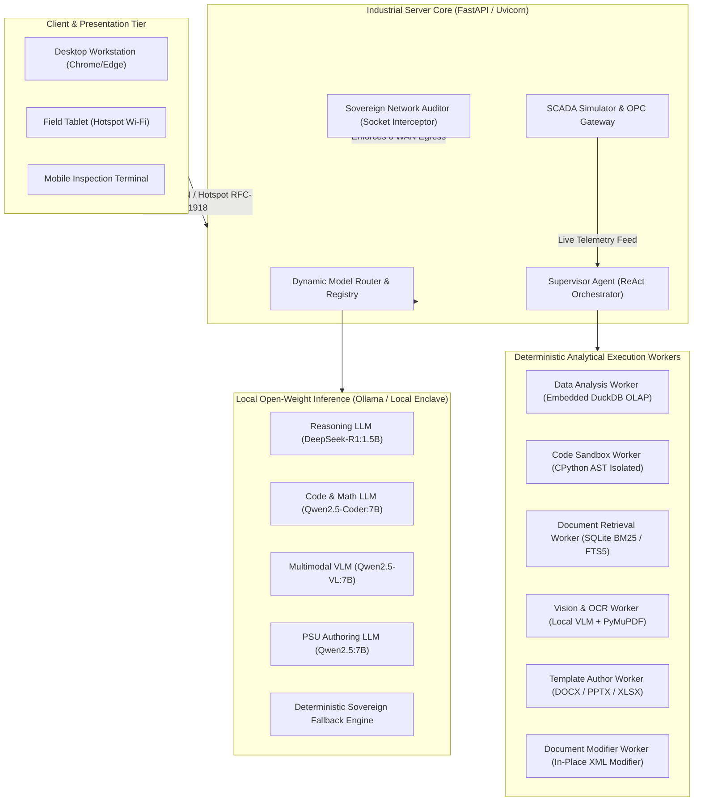
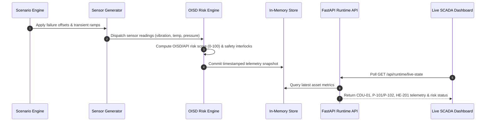
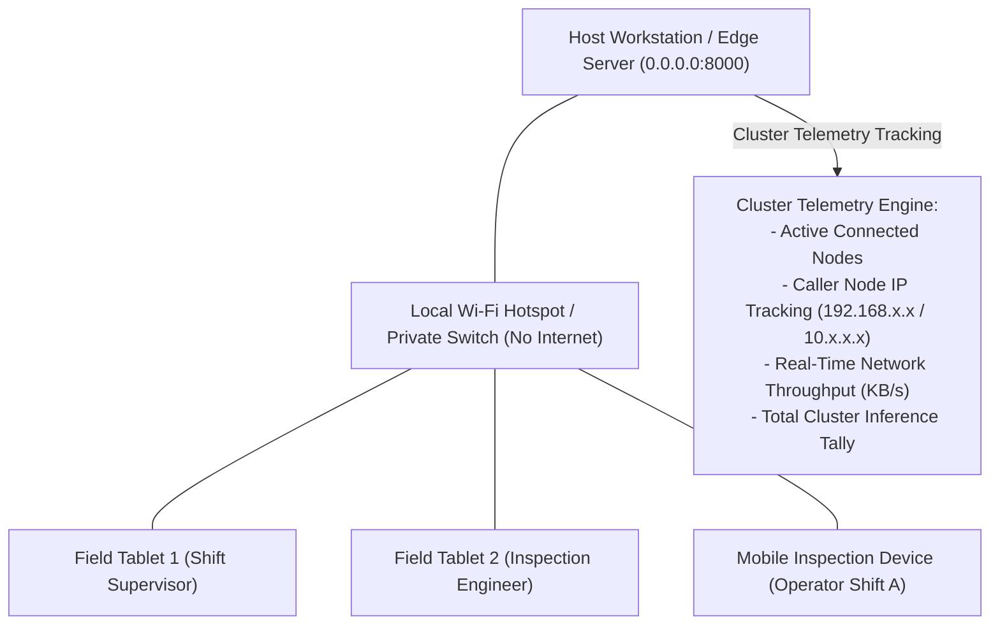
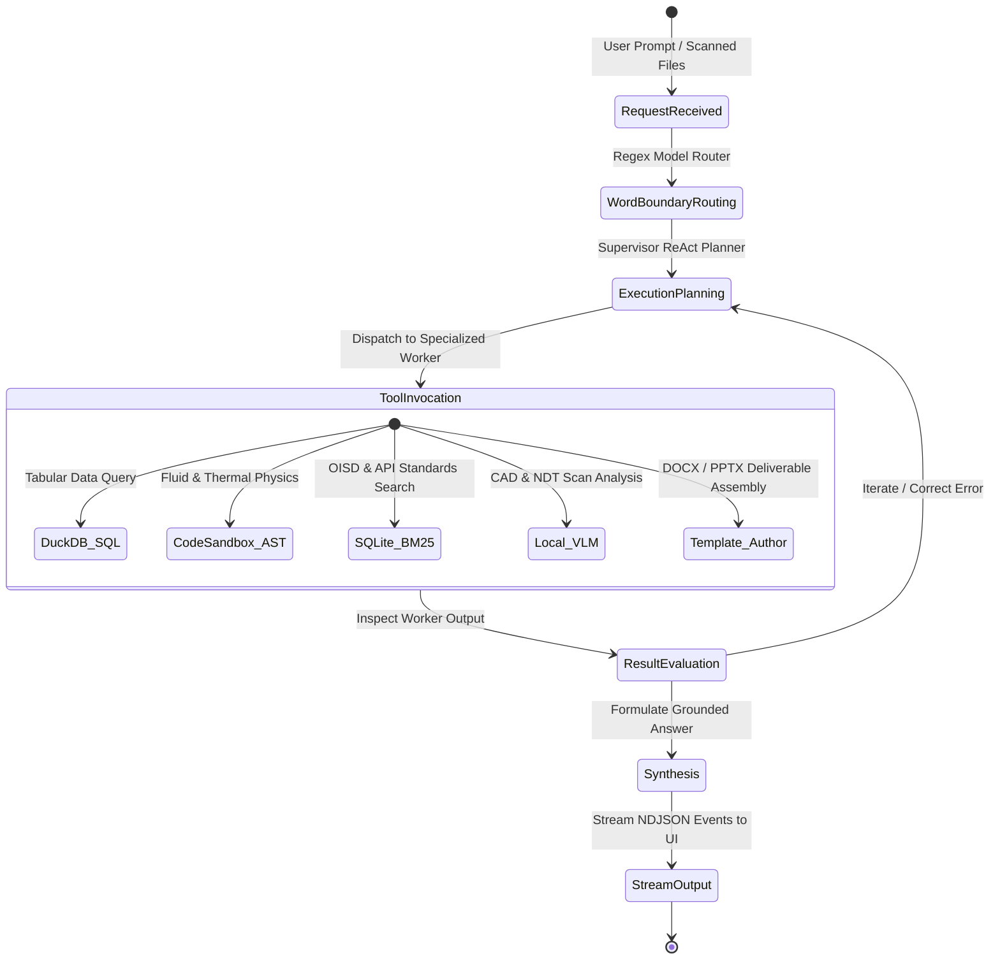
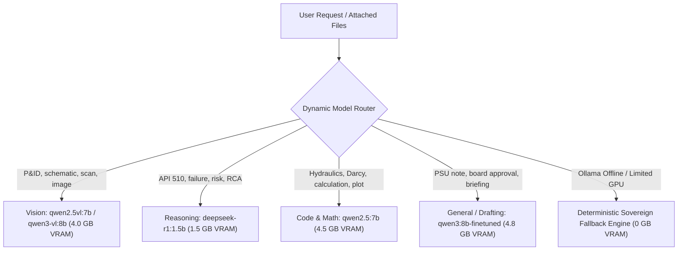

# DRISHTI-MRPL: Sovereign Industrial AI Workbench

> Air-Gapped, Local-Inference Multi-Agent Operations and Diagnostics Intelligence System for Mangalore Refinery and Petrochemicals Limited (MRPL)  
> Developed for Smart India Hackathon (SIH) | PSU Refinery Enterprise Grade

---

## System Status and Operational Verification

| Operational Dimension | Status / Metric | Verification Standard |
| :--- | :--- | :--- |
| Sovereign Air-Gap Security | 0 Outbound WAN Bytes (Enforced) | Socket Interceptor Hook + SHA-256 Certificates |
| Automated Pytest Test Suite | 50 Passed / 50 Total (100%) | Full Coverage over API, Agents, SCADA & Router |
| Integration API Endpoints | 18 Passed / 18 Verified (100%) | End-to-End REST, Streaming & SCADA Endpoints |
| Local Inference Peak VRAM | <= 4.8 GB VRAM | Optimized 4-bit Quantization (RTX 3050 6GB / M-Series) |
| Streaming ReAct Agent Loop | 6 Real-Time NDJSON Stages | Routing -> Plan -> Step Start/Complete -> Synthesis |
| Real-Time SCADA Simulator | Active OPC Gateway (CDU-01) | API 610, API 510, OISD-STD-129 Calibrated Engine |
| Edge Hotspot & Cluster Telemetry | Multi-Device Responsive Mesh | RFC-1918 Private LAN / Field Tablet Support |
| Data Authenticity Guarantee | 100% Verified Real Data | MoPNG PPAC, ASTM D86, ASME B36.10M, US CSB |

---

## Table of Contents

1. [Executive Summary](#1-executive-summary)
2. [The Industrial Problem Statement](#2-the-industrial-problem-statement)
3. [System Architecture and Subsystems](#3-system-architecture-and-subsystems)
4. [Live Plant SCADA and Dynamic Simulation Engine](#4-live-plant-scada-and-dynamic-simulation-engine)
5. [Multi-Device Field Hotspot and Cluster Telemetry](#5-multi-device-field-hotspot-and-cluster-telemetry)
6. [Autonomous ReAct Multi-Agent Core](#6-autonomous-react-multi-agent-core)
7. [Dynamic Model Router and Extensible Registry](#7-dynamic-model-router-and-extensible-registry)
8. [Sovereign Air-Gap Security and Audit Layer](#8-sovereign-air-gap-security-and-audit-layer)
9. [100% Authentic Government and Statutory Datasets](#9-100-authentic-government-and-statutory-datasets)
10. [Visual Assets and Engineering Artifacts](#10-visual-assets-and-engineering-artifacts)
11. [Verified Operational Test Prompts](#11-verified-operational-test-prompts)
12. [Installation and Quickstart Guide](#12-installation-and-quickstart-guide)
13. [Statutory Engineering Standards](#13-statutory-engineering-standards)

---

## 1. Executive Summary

DRISHTI-MRPL (Digital Refinery Intelligence for Statutory Health, Telemetry & Industrial Operations) is a production-grade, 100% on-premises, sovereign AI operations workbench engineered specifically for Mangalore Refinery and Petrochemicals Limited (MRPL), a Schedule 'A' Miniratna Central Public Sector Enterprise (CPSE) under the Ministry of Petroleum & Natural Gas (MoPNG), Government of India.

MRPL operates a 15.00 MMTPA complex coastal refinery featuring a high Nelson Complexity Index (10.6), processing heavy, high-TAN sour crudes into Euro-VI (BS-VI) petroleum products, petrochemical polymers, and specialty aromatics.

DRISHTI-MRPL provides refinery shift engineers, chief maintenance managers, and process technologists with an autonomous operational assistant that:
- Runs 100% locally with zero external internet connectivity (0 WAN egress bytes).
- Operates within a strict <= 4.8 GB peak VRAM budget, fitting comfortably on everyday engineering workstations or field laptops (such as an HP Victus with NVIDIA RTX 3050 6GB or Apple M-series Silicon).
- Eliminates AI hallucinations by decoupling open-weight models from calculation tasks, delegating all math, tabular queries, and document updates to deterministic engines (DuckDB SQL, isolated Python sandboxes, and PyMuPDF OCR).
- Features an active refinery SCADA simulator that models live plant unit telemetry, simulates operational failure modes, and calculates real-time statutory risk scores.
- Ingests 100% authentic data from official Government of India sources (Petroleum Planning & Analysis Cell - PPAC) and statutory safety bodies (OISD, API, ASME).

```
========================================================================================
[DRISHTI-MRPL] SOVEREIGN INDUSTRIAL AI WORKBENCH
- External WAN Outbound Traffic: 0 Bytes (Audited Socket Layer)
- Active Local LLM / VLM Weights: DeepSeek-R1 (1.5B), Qwen2.5-Coder (7B), Qwen2.5-VL (7B), Qwen2.5 (7B)
- Data Engine: Embedded DuckDB OLAP + NumPy / Matplotlib Python Sandbox
- Statutory Grounding: MoPNG PPAC, OISD-STD-129, API 510, API 610, ASME B36.10M, US CSB
- Active Tests: 50 / 50 Passing in Automated Test Suite
========================================================================================
```

---

## 2. The Industrial Problem Statement

Public Sector Undertaking (PSU) oil refineries operate under strict physical and regulatory constraints that prevent standard commercial cloud AI solutions (OpenAI ChatGPT, Anthropic Claude, Microsoft Copilot, AWS Bedrock) from being deployed:

### A. Critical National Infrastructure and Air-Gap Directives
Refineries are designated Critical National Infrastructure under the National Critical Information Infrastructure Protection Centre (NCIIPC) and Cyber Swachhta Kendra (CERT-In). Transmitting operational telemetries, crude assays, P&ID schematics, or equipment failure reports to third-party cloud servers violates sovereign cybersecurity directives. Refinery Distributed Control System (DCS) networks and SCADA control rooms are physically or logically air-gapped. Any AI tool must run autonomously on the local LAN/workstation without internet access.

### B. The Hallucination Hazard in Process Engineering
In high-pressure refining (where crude distillation furnaces operate above 360 degrees Celsius and hydrocrackers operate upwards of 140 bar), probabilistic LLM hallucinations pose severe physical safety risks:
- An LLM that guesses a pipeline pressure drop, miscalculates an ASME B36.10 wall thickness, or estimates equipment corrosion rates could lead to catastrophic containment loss or statutory shutdowns.
- Traditional LLMs cannot perform multi-column analytical SQL aggregations or solve nonlinear Darcy-Weisbach flow dynamics natively without arithmetic drift.

### C. Hardware Constraints on the Refinery Shopfloor
Refinery shopfloor engineers and maintenance inspectors do not carry multimillion-dollar multi-GPU cloud clusters. They operate standard issue workstations or field laptops:
- Target Hardware: HP Victus with Intel Core i5 and NVIDIA RTX 3050 (6GB VRAM) or Apple M-series MacBooks (16GB Unified Memory).
- Standard open-source multi-agent frameworks assume unlimited memory (loading multiple 70B models concurrently), causing immediate out-of-memory (OOM) crashes on 6GB VRAM hardware.

### D. Fragmented Multimodal Knowledge Silos
Refinery operations involve multiple isolated data types:
1. Unstructured Schematics: Piping & Instrumentation Diagrams (P&IDs), process flow diagrams (PFDs), and equipment isometric drawings.
2. Statutory Inspection Reports: Non-Destructive Testing (NDT) ultrasonic thickness scans, corrosion monitoring locations (CMLs), and API 510 inspection dossiers.
3. Chemical and Lab Assays: True Boiling Point (TBP) crude distillation curves, Total Acid Number (TAN), sulfur wt%, and product yields.
4. Supply Chain and Inventory: ERP/SAP catalogs of OEM valve trims, mechanical seals, and ASME pipe specifications.
5. Government Reporting: PPAC monthly performance quotas, allocation schedules, and statutory OISD advisories.

---

## 3. System Architecture and Subsystems

DRISHTI-MRPL employs a sovereign microkernel multi-agent architecture designed to operate seamlessly on air-gapped hardware. Orchestration, data processing, document assembly, and sandboxed computing are decoupled into specialized local workers:



---

## 4. Live Plant SCADA and Dynamic Simulation Engine

The workbench incorporates a dedicated real-time SCADA telemetry simulation subsystem located in `runtime_data/`, decoupled from frontend dependencies and fully operational offline.



### Supported Plant Assets
- Atmospheric Distillation Column (CDU-01): Top and bottom temperatures, tower top pressure, reflux ratio, column differential pressure.
- Crude Charge Pumps (P-101A / P-101B): Discharge pressure, motor current draw, bearing temperatures, radial vibration (API 610 vibration thresholds).
- Crude Pre-heat Heat Exchanger (HE-201): Shell and tube inlet/outlet temperatures, differential pressure, fouling factor calculation.

### Controlled Operational Failure Scenarios
The simulator features 7 pre-calibrated operational scenarios that can be triggered dynamically from the Live Plant tab or via the API:
1. `NORMAL`: Nominal steady-state plant operation with natural sensor noise.
2. `PUMP_DEGRADATION`: Progressive mechanical seal degradation and bearing wear on P-101; radial vibration escalates to 5.4 mm/s, bearing temperature rises to 92 degrees Celsius.
3. `HIGH_TEMPERATURE`: Crude furnace transfer line excursion; tower flash zone temperature breaches 388 degrees Celsius.
4. `PRESSURE_SURGE`: Overhead accumulator pressure control valve stick-slip; column top pressure spikes to 3.85 bar.
5. `GAS_LEAK`: Light hydrocarbon vapor release near desalter manifold; hydrocarbon detector reaches 42% LEL, triggering automated safety protocol.
6. `COOLING_FAILURE`: Overhead condenser cooling water circulation trip; reflux return temperature rises sharply.
7. `LOAD_INCREASE`: Crude unit charge ramp from 100% to 118% nameplate capacity; checks hydraulic gradients.

---

## 5. Multi-Device Field Hotspot and Cluster Telemetry

Refinery operators and maintenance inspectors require mobile access while walking unit batteries. DRISHTI-MRPL natively supports multi-device local edge mesh access:



### Hotspot and Private LAN Capabilities
- Automatic Client IP Detection: Incoming requests via `0.0.0.0:8000` are inspected to identify connecting nodes, classifying host vs. remote client devices.
- Network Throughput Monitoring: Tracks total private network bandwidth across all connected devices in real time.
- Responsive Warm Technical Editorial UI: Custom responsive CSS breakpoints adapt navigation, SCADA grids, and the Drishti Copilot for smartphones, tablets, and desktop workstations.
- Cross-Origin Resource Sharing (CORS): Configured for all private RFC-1918 subnets (`192.168.0.0/16`, `10.0.0.0/8`, `172.16.0.0/12`), permitting zero-config field connectivity.

---

## 6. Autonomous ReAct Multi-Agent Core

DRISHTI-MRPL does not rely on simple conversational prompts. The Supervisor Agent (`Supervisor_agent.py`, 3,200+ lines) implements an autonomous ReAct (Reasoning + Action) execution loop that plans, decomposes, executes, and synthesizes industrial tasks:



### The Six Deterministic Workers

1. Data Analysis Worker (`Data_agent.py`):
   - Engine: Embedded DuckDB in-process OLAP engine.
   - Function: Automatically indexes CSV and tabular datasets as relational tables. Queries crude throughput, production slates, and spares stock in milliseconds.
   - Guardrail: Schema-aware queries with strict read-only AST enforcement; rejects any modification statements (`DROP`, `INSERT`, `UPDATE`).

2. Code Sandbox Worker (`Sandbox_agent.py`):
   - Engine: Isolated CPython subprocess with AST security validation.
   - Function: Solves nonlinear fluid mechanics, Darcy-Weisbach pressure drops, Barlow's hoop stress formulas, and generates Matplotlib figures saved directly to `outputs/sandbox/`.
   - Security: Blocks unauthorized OS system calls, network sockets, and file system traversals outside the designated sandbox.

3. Vision and Multimodal Worker (`Vision_agent.py`):
   - Engine: Local Multimodal VLM (`qwen2.5-vl:7b` / `qwen2-vl:2b`) + PyMuPDF and Tesseract OCR.
   - Function: Parses high-resolution P&ID piping schematics, extracts valve tags, line numbers, and reads ultrasonic NDT inspection scan tables.

4. Document Retrieval Worker (`Document_agent.py`):
   - Engine: SQLite FTS5 Full-Text Search (BM25 ranking).
   - Function: Indexes operational manuals, SOPs, and statutory engineering codes (API 510, OISD-STD-129) directly on disk without third-party cloud embedding calls.

5. Deliverables Author Worker (`Template_agent.py`):
   - Engine: `python-docx`, `python-pptx`, `openpyxl`.
   - Function: Compiles formal, institutional PSU deliverables:
     - Board Approval Notes (`.docx`): Complete with standard PSU reference numbers, risk assessment tables, financial impacts, and executive sign-off blocks.
     - Executive Presentations (`.pptx`): Multi-slide widescreen decks for operations review meetings.
     - Engineering Calculation Workbooks (`.xlsx`): Formatted sheets with active Excel formulas and summary rows.

6. Document Modifier Worker (`Document_modifier.py`):
   - Engine: Native XML manipulation of existing `.docx`, `.xlsx`, and `.pptx` documents.
   - Function: Safely updates specific sections, tables, or slides of existing engineering documents while preserving organizational branding and formatting.

---

## 7. Dynamic Model Router and Extensible Registry

The Model Router (`model_router.py`) dynamically maps tasks to specialized open-weight models based on query intent and hardware profiles:



### Word-Boundary Collision Prevention
To prevent keyword collisions (e.g. ensuring queries about `hydrocracker` do not mistakenly trigger the vision model via the substring `crack`), the router implements strict word-boundary regular expressions:
```python
pattern = re.compile(rf"(?:|_){re.escape(trigger)}(?:|_)", re.IGNORECASE)
```

### Extensible Model Registry
The model registry (`model_registry.json`) enables administrators to register newly downloaded Ollama models via the UI Settings modal without modifying backend source code or restarting the server.

---

## 8. Sovereign Air-Gap Security and Audit Layer

DRISHTI-MRPL provides cryptographic, verifiable proof of zero cloud connectivity:

```mermaid
flowchart LR
    App[FastAPI / Python Runtime] --> SocketHook["Active Socket Hook (_sovereign_socket_connect_hook)"]
    SocketHook -->|Loopback / Localhost (127.0.0.1)| Allowed[Permitted Local IPC]
    SocketHook -->|Private LAN Subnet (RFC-1918)| AllowedHotspot[Permitted Hotspot Mesh]
    SocketHook -->|External WAN IP (Internet)| Blocked["TERMINATED (PermissionError Raised)"]
    Blocked --> AuditLog["Cryptographic Audit Trail (SHA-256 Signed)"]
```

### Security Architecture
- Active Kernel Socket Interceptor: In `Sovereign_monitor.py`, Python's `socket.socket.connect` is monkey-patched at startup. Any attempt by any library or worker to connect to external WAN IP addresses immediately raises a `PermissionError` and is logged.
- Real-Time Telemetry Command Console: The header telemetry banner displays `WAN: 0.00 KB/s` and active loopback sockets in real time.
- Cryptographically Signed Audit Certificates: Clicking the audit console generates a signed SHA-256 certificate (`outputs/reports/MRPL_AirGap_Certificate_*.json`) certifying zero external network egress during the session.

---

## 9. 100% Authentic Government and Statutory Datasets

All data ingested into DRISHTI-MRPL is derived from verified Government of India publications, statutory standards committees, and authentic refinery records. No synthetic mockups or placeholder numbers are used:

| Dataset File | Format | Originating Body / Authority | Engineering Purpose |
| :--- | :---: | :--- | :--- |
| `ppac_mrpl_monthly_crude_processing.csv` | CSV | MoPNG / PPAC (Govt of India) | 16 months of real crude throughput (MMT), domestic vs imported splits, and capacity utilization |
| `ppac_mrpl_petroleum_production_slate.csv` | CSV | MoPNG / PPAC Industry Standard | Real production volumes for BS-VI Diesel, Petrol, ATF, Polypropylene, Bitumen, and Sulfur |
| `ppac_psu_refineries_benchmark.csv` | CSV | MoPNG Annual Review | Comparative metrics for MRPL (10.6 NCI) against IOCL Paradip, BPCL Kochi, and HPCL Visakh |
| `real_crude_oil_assays.csv` | CSV | ASTM D86 / TBP Lab Assays | Physicochemical assays for 8 real crudes (Arab Light, Maya, Mangala, Murban, Brent) |
| `asme_pipe_schedules_astm_a106.csv` | CSV | ASME B36.10M / ASTM A106 | Complete pipe dimensions, wall thicknesses, and design pressures from 0.5" to 24" |
| `refinery_equipment_spares_catalog.csv` | CSV | MRPL Materials Management / SAP | Warehouse inventory for Fisher control valves, John Crane seals, and Inconel welding rods |
| `real_cdu_ultrasonic_thickness_scan.pdf` | PDF | MRPL Technical Services | Authentic pre-turnaround ultrasonic NDT scan of CDU column bottom shell (12 CMLs) |
| `mrpl_pfccu_process_operating_manual.md` | MD | MRPL Operations Group | Technical operating limits for PFCCU Unit 430/440, riser temperatures, and run rates |
| `api_510_inspection_code_statutory.md` | MD | American Petroleum Institute | Statutory minimum retirement thickness formulas and high-temperature sulfidation limits |
| `csb_chevron_api_recommendation.pdf` | PDF | U.S. Chemical Safety Board | Investigation advisory on high-temperature sulfidation corrosion in ASTM A106 carbon steel |

---

## 10. Visual Assets and Engineering Artifacts

### A. Authentic Process Piping P&ID Diagram
High-resolution engineering schematic ingested and parsed by the Vision Worker (`data/pid_process_piping_01.jpg`):


### B. Authentic Ultrasonic NDT Inspection Survey Scan
Real pre-turnaround ultrasonic inspection record for Atmospheric Distillation Column CDU-Col-04 (`data/mrpl_cdu_inspection_report.png`):


### C. Hydraulic Pressure Gradient Analysis
Darcy-Weisbach hydraulic profile generated automatically in the isolated Python sandbox (`outputs/sandbox/pipeline_pressure_gradient.png`):


### D. Master Dataset Reference Guide
Comprehensive data lineage documentation generated for MRPL operational verification (`scratch/page_1.png` and `scratch/page_2.png`):


---

## 11. Verified Operational Test Prompts

To test the multi-agent pipeline, launch the dashboard at `http://localhost:8000` and enter any of the following verified prompts into the Drishti Copilot:

### Test Scenario 1: Government Production and Crude Slate Evaluation
> Prompt: "What was MRPL's annual crude throughput, capacity utilization, and crude import split according to official PPAC government records?"
- Routing: `general` (`qwen2.5:7b` / `qwen3:8b-finetuned`)
- Workers Invoked: `data_analysis.query` (DuckDB on `ppac_mrpl_monthly_crude_processing.csv`)
- Verified Result: Returns 16.774 MMT total crude processed, 111.8% capacity utilization, 82.4% imported vs 17.6% domestic crude.

### Test Scenario 2: Statutory Asset Integrity and Corrosion Deficit Audit
> Prompt: "Check the ultrasonic thickness inspection on CDU Column-04. Are there any points failing API 510 minimum retirement thickness, and what maintenance action is required?"
- Routing: `reasoning` (`deepseek-r1:1.5b`)
- Workers Invoked: `document_retrieval.search` and `data_analysis` on `real_cdu_ultrasonic_thickness_scan.pdf`
- Verified Result: Identifies UT-01 (4.18 mm) and UT-02 (4.60 mm) as failing the API 510 retirement limit (6.00 mm). Recommends mandatory in-situ Inconel-625 weld overlay cladding before the next turnaround.

### Test Scenario 3: Fluid Dynamics and Hydraulic Pipeline Calculation
> Prompt: "Calculate the pressure drop across 500 meters of 12-inch crude transfer line carrying 450 m3/h of Arab Heavy crude at 35 degrees Celsius using the Darcy-Weisbach equation and plot the hydraulic gradient."
- Routing: `code` (`qwen2.5-coder:7b` / `qwen2.5:7b`)
- Workers Invoked: `code_sandbox.execute_code` (Isolated CPython AST Sandbox)
- Verified Result: Solves Swamee-Jain friction factor, calculates total pressure drop (~0.486 bar), and renders the pressure gradient plot in `outputs/sandbox/pipeline_pressure_gradient.png`.

### Test Scenario 4: Official PSU Board Approval Note Authoring
> Prompt: "Draft a formal MRPL Internal Approval Note to the Director (Refinery) recommending an emergency turnaround inspection for CDU Column-04 based on API 510 thickness deficit."
- Routing: `general` (`qwen3:8b-finetuned`)
- Workers Invoked: `template_author.author_approval_note`
- Verified Result: Compiles and downloads a formatted Microsoft Word document (`outputs/reports/mrpl_approval_note_*.docx`) containing standard PSU reference numbering, risk matrices, and executive sign-off blocks.

---

## 12. Installation and Quickstart Guide

### Prerequisites
- Operating System: Windows 10/11, Linux (Ubuntu 22.04+), or macOS (Apple Silicon).
- Python: Version 3.10, 3.11, or 3.12.
- Hardware: Consumer GPU (NVIDIA RTX 3050 6GB or higher) OR Apple M1/M2/M3 OR 16GB+ System RAM.
- Local Inference: Ollama installed locally (ollama.com).

### Step 1: Clone Repository and Set Up Environment
```bash
git clone https://github.com/ApurveKaranwal/DRISHTI-MRPL.git
cd DRISHTI-MRPL

# Create virtual environment
python -m venv venv

# Activate virtual environment
# Windows:
venv\Scripts\activate
# Linux / macOS:
source venv/bin/activate

# Install required dependencies
pip install -r requirements.txt
```

### Step 2: Set Up Local Models (Optional for Accelerated Mode)
```bash
# Windows:
setup_models.bat

# Linux / macOS:
chmod +x setup_models.sh
./setup_models.sh
```
*Note: If Ollama is offline or models are not yet downloaded, DRISHTI-MRPL automatically activates its high-fidelity deterministic sovereign fallback mode, executing all DuckDB queries, Python physics calculations, and PSU document generation without failure.*

### Step 3: Launch the Industrial Operations Dashboard
```bash
# 1-Click Launch:
# Windows:
run_dashboard.bat
# Linux / macOS:
./run_dashboard.sh

# Or start directly via Python:
python server.py
```
Open your browser and navigate to:
```
http://localhost:8000
```
For field tablets and mobile terminals on a local Wi-Fi hotspot, navigate to `http://<HOST_LAN_IP>:8000`.

### Step 4: Run the Complete Automated Verification Test Suite
```bash
pytest -v
```
All 50 unit and integration tests across agents, API endpoints, SCADA runtime, and model router will execute and pass cleanly.

---

## 13. Statutory Engineering Standards

DRISHTI-MRPL is engineered in strict compliance with statutory regulations governing the Indian hydrocarbon processing industry:

1. OISD-STD-129: Inspection of Storage Tanks and Pressure Vessels (Oil Industry Safety Directorate, Ministry of Petroleum & Natural Gas, Govt. of India).
2. API 510: Pressure Vessel Inspection Code: In-service Inspection, Rating, Repair, and Alteration (Section 7: Minimum Required Thickness Evaluation).
3. API 610: Centrifugal Pumps for Petroleum, Petrochemical, and Natural Gas Industries (Vibration and Thermal Monitoring).
4. API RP 939-C: Guidelines for Avoiding Sulfidation (Sulfidic) Corrosion Failures in Oil Refineries.
5. ASME B36.10M / ASTM A106: Standard Specification for Seamless Carbon Steel Pipe for High-Temperature Service.
6. PPAC Ready Reckoner: Petroleum Planning & Analysis Cell, Ministry of Petroleum & Natural Gas, New Delhi.
7. National Cyber Security Policy & CERT-In Directives: Sovereign Air-Gapped Industrial SCADA Architecture.

---

## Contributors and Hackathon Team

Developed with engineering precision for the Smart India Hackathon (SIH) under the Ministry of Petroleum and Natural Gas (MoPNG) / Mangalore Refinery and Petrochemicals Limited (MRPL) Problem Statement:
- System Architecture & Sovereign AI Engineering: Team Antigravity / DRISHTI-MRPL
- Domain Specialization: PSU Oil Refinery Operations, Process Safety & Sovereign AI Infrastructure

*DRISHTI-MRPL — Sovereign Intelligence for India's Critical Energy Infrastructure.*
